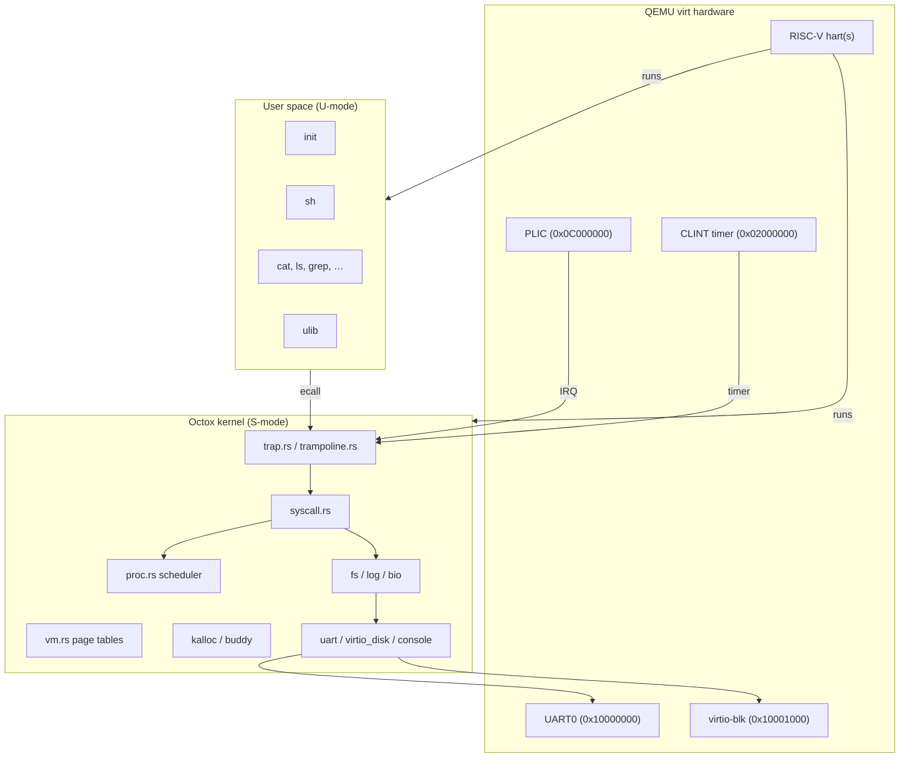
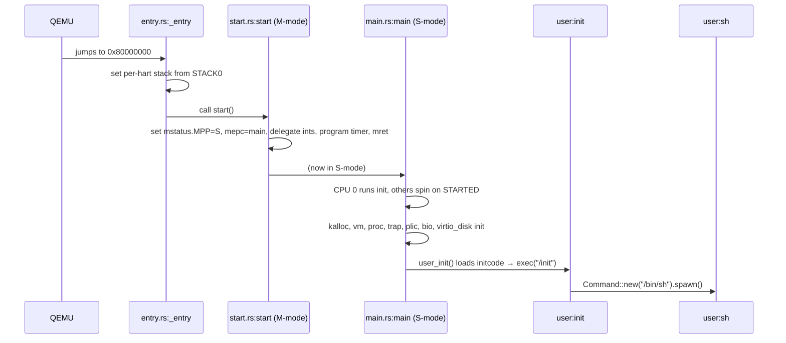
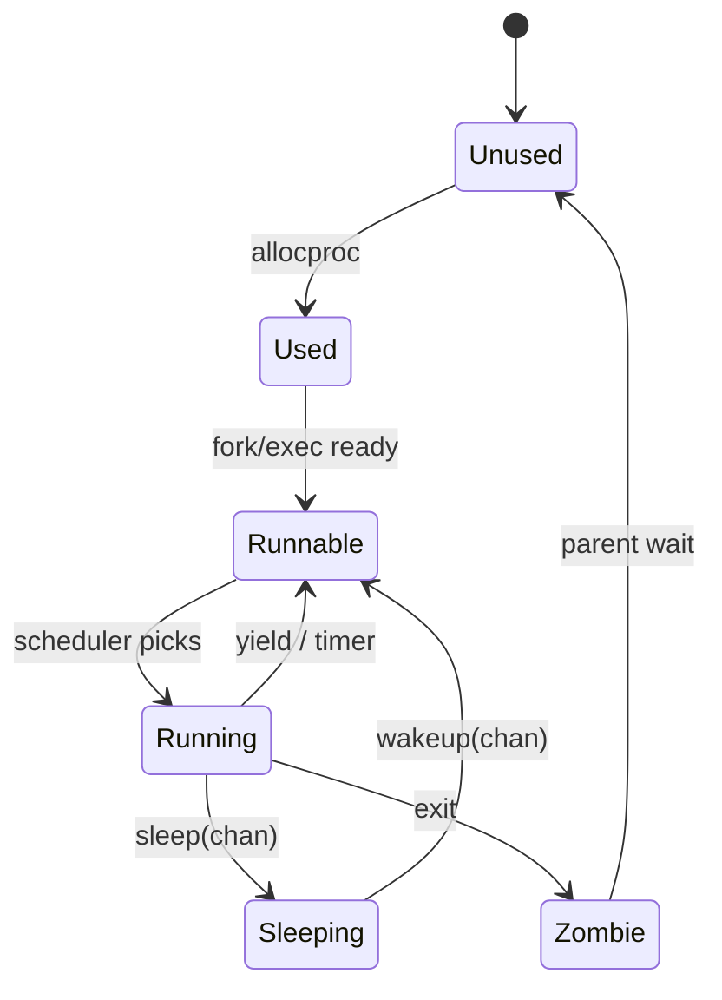
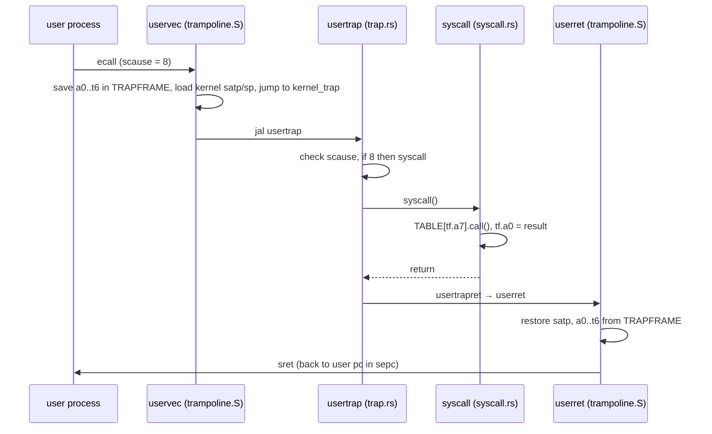
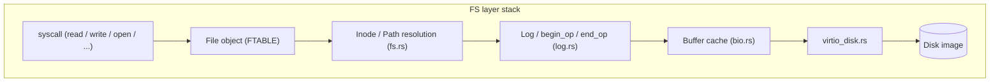
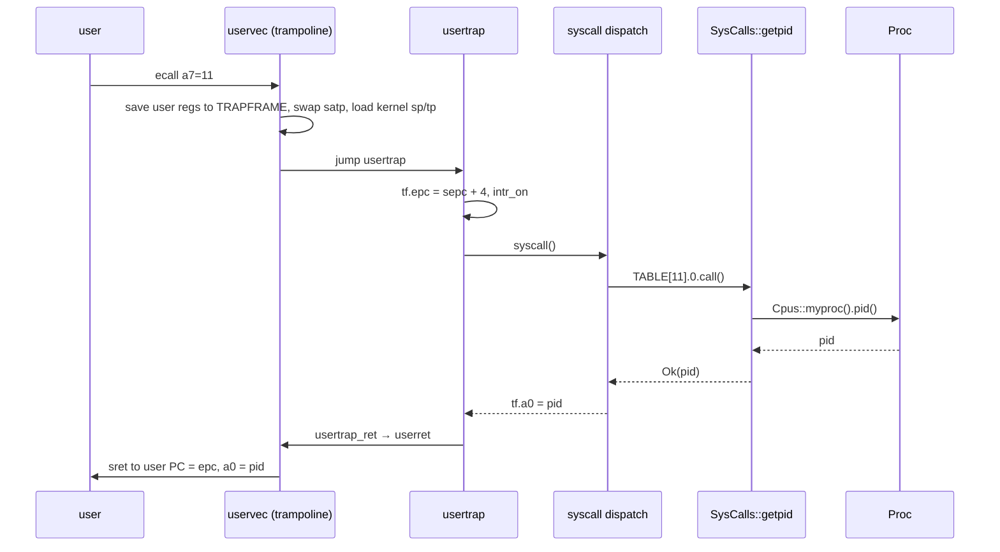
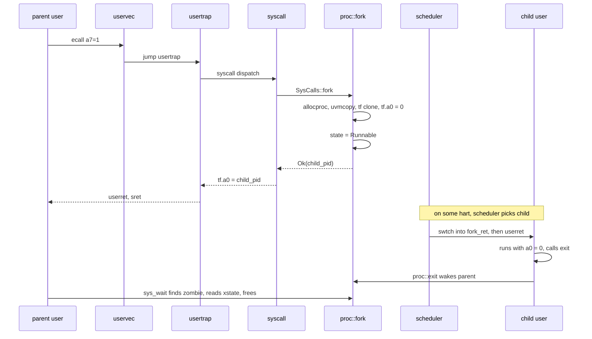
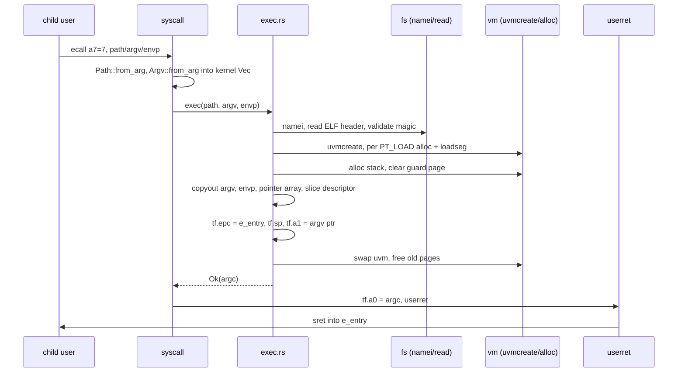
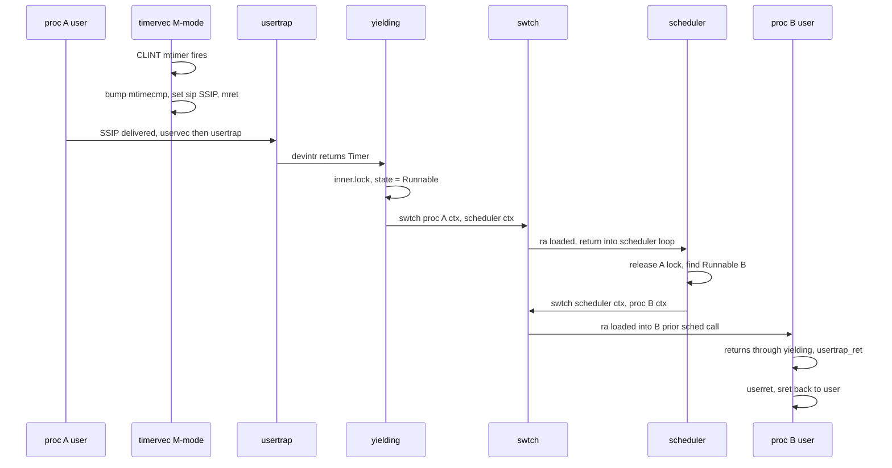
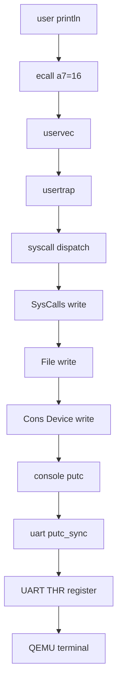

# The Octox Guide

A complete overview of **Octox** — a Unix-like operating system written in pure Rust, closely modelled on `xv6-riscv` — intended as a companion text for a student learning both kernel design and the Rust patterns idiomatic to systems code.

Each major section follows a three-part shape:

1. **Concept** — the general OS-design idea (what problem, what alternatives, what tradeoffs).
2. **Code** — how Octox implements it, with `file:line` references.
3. **Commentary / Rust notes** — what Octox's specific choice means, and Rust idioms a C programmer hasn't seen.

---

## Table of contents

1. [Introduction](#1-introduction)
2. [High-level architecture](#2-high-level-architecture)
3. [Build system](#3-build-system)
4. [Kernel deep dive](#4-kernel-deep-dive)
5. [User-space deep dive](#5-user-space-deep-dive)
6. [Guide: writing a new user program](#6-guide-writing-a-new-user-program)
7. [Guide: modifying the kernel (adding a system call)](#7-guide-modifying-the-kernel-adding-a-system-call)
8. [Operation walkthroughs](#8-operation-walkthroughs)
9. [System call reference](#9-system-call-reference)
10. [Rust for C programmers](#10-rust-for-c-programmers)
11. [Appendices](#11-appendices)

---

## 1. Introduction

Octox is a teaching operating system. It implements the classic Unix abstractions — processes, files, pipes, a hierarchical filesystem, a shell — on top of the RISC-V 64-bit privileged architecture, and runs under QEMU's `virt` machine. The codebase's distinguishing property is that it is written in pure Rust, including the kernel, user library, filesystem builder, and build scripts. There are no external crates.

Relative to the C original `xv6-riscv`, Octox adds:

- A **buddy allocator** for kernel-side physical memory (`kalloc.rs`, `buddy.rs`) instead of a single-size freelist.
- An **`std`-like user library** (`ulib`) with `Read`/`Write` traits, `Command`/`Child` process APIs, `OpenOptions` file builders, and a K&R-style heap allocator.
- **Strongly-typed address spaces** via the `PAddr`, `KVAddr`, `UVAddr` types, preventing a whole class of kernel/user pointer confusion bugs at compile time.
- An **auto-generated user-space syscall stub layer**: adding a syscall requires kernel-side changes only; `build.rs` emits the user-space wrapper.

Target triple: `riscv64gc-unknown-none-elf`. Toolchain: nightly Rust (see `rust-toolchain.toml`). Emulator: `qemu-system-riscv64`.

### 1.1 Build and run

```sh
# one-time: install QEMU
# Debian: sudo apt install qemu-system-misc
# macOS:  brew install qemu

cargo build --target riscv64gc-unknown-none-elf
cargo run   --target riscv64gc-unknown-none-elf      # boots into the shell
# Ctrl-a x to exit QEMU; Ctrl-p dumps processes; Ctrl-d is EOF in the shell
```

---

## 2. High-level architecture

### 2.1 Workspace layout

```
octox/
├── Cargo.toml             # top-level crate: builds the kernel binary
├── build.rs               # host-side: builds user programs + mkfs + fs.img
├── rust-toolchain.toml
├── src/
│   ├── kernel/            # the kernel (libkernel + octox binary)
│   │   ├── main.rs        # kernel entry (post-boot)
│   │   ├── entry.rs       # _entry asm stub
│   │   ├── start.rs       # M-mode → S-mode handoff
│   │   ├── proc.rs        # processes, CPUs, scheduler
│   │   ├── trap.rs        # trap handlers (kernel-side)
│   │   ├── trampoline.rs  # user↔kernel trap entry asm
│   │   ├── syscall.rs     # syscall table, dispatch, argument fetch
│   │   ├── vm.rs          # Sv39 page tables, typed addresses
│   │   ├── kalloc.rs      # global allocator glue
│   │   ├── buddy.rs       # buddy allocator
│   │   ├── fs.rs          # on-disk + in-memory filesystem
│   │   ├── log.rs         # crash-consistency WAL
│   │   ├── bio.rs         # block buffer cache
│   │   ├── file.rs        # file descriptors, FTABLE
│   │   ├── exec.rs        # ELF loader
│   │   ├── elf.rs         # ELF headers
│   │   ├── uart.rs        # 16550 UART driver
│   │   ├── virtio_disk.rs # virtio-blk driver
│   │   ├── plic.rs        # interrupt controller
│   │   ├── console.rs     # line discipline
│   │   ├── spinlock.rs, sleeplock.rs, condvar.rs,
│   │   ├── semaphore.rs, mpmc.rs, sync.rs, list.rs
│   │   ├── pipe.rs, printf.rs, error.rs, param.rs, defs.rs,
│   │   ├── memlayout.rs, riscv.rs, kernelvec.rs, swtch.rs,
│   │   └── kernel.ld      # linker script
│   ├── user/              # userland
│   │   ├── Cargo.toml     # declares each bin as `_name` → mkfs names it `name`
│   │   ├── build.rs       # generates usys.rs from SysCalls enum
│   │   ├── user.ld        # user linker script (ENTRY = main)
│   │   ├── lib/           # ulib (libc-equivalent)
│   │   └── bin/           # init, sh, cat, ls, echo, grep, …
│   └── mkfs/              # host tool that builds fs.img
```

### 2.2 System architecture



### 2.3 Memory map


Source: `src/kernel/memlayout.rs`. `TRAMPOLINE = MAXVA - PGSIZE` and `TRAPFRAME = TRAMPOLINE - PGSIZE` are mapped in *every* process's page table and in the kernel's, at identical virtual addresses, so the trap-entry code can run across the page-table switch.

### 2.4 Boot chain



---

## 3. Build system

`rust-toolchain.toml` pins a nightly channel with the `riscv64gc-unknown-none-elf` target so the same `cargo` invocation produces a bare-metal kernel.

The top-level `build.rs` is the glue:

1. Calls `cargo install --path src/user --root $OUT_DIR` to build every user binary as a standalone `riscv64gc-unknown-none-elf` ELF.
2. Calls `cargo install --path src/mkfs --root $OUT_DIR` to build the **host-side** `mkfs` tool (this one is compiled for the build machine's triple, not RISC-V).
3. Invokes `mkfs fs.img README.org <all user ELFs>` to produce a filesystem image containing `/init`, `/bin/*`, `/lib/*`, `/etc/*`.
4. Emits `cargo:rustc-link-arg-bin=octox=--script=src/kernel/kernel.ld` so cargo links the kernel binary with the custom linker script.

The user-side `src/user/build.rs` does one clever thing: it iterates `SysCalls` enum variants and writes `$OUT_DIR/usys.rs` — the user-space syscall wrappers — by calling `gen_usys()` on each variant. The generated file is `include!`-ed from `src/user/lib/lib.rs`, so a new syscall appears as a `ulib::sys::foo()` function with no hand-written stub.

Linker scripts:

- `src/kernel/kernel.ld` — entry `_entry`, text starts at `0x80000000`, trampoline section aligned to a page boundary.
- `src/user/user.ld` — entry `main`, text at `0x0`, `PROVIDE(end = .)` exposes the heap-end symbol that `sbrk` grows past.

`libkernel` carries a `feature = "kernel"` flag. When the user crate depends on `libkernel` *without* that feature (just to reuse the `SysCalls` enum for codegen), all kernel-only `#[cfg(all(target_os = "none", feature = "kernel"))]` blocks are excluded. That is why every syscall handler in `src/kernel/syscall.rs` starts with a short dummy branch for the non-kernel compilation.

---

## 4. Kernel deep dive

### 4.1 Boot (entry → start → main)

**Concept.** RISC-V powers on in **machine mode** (M-mode), the most privileged of three rings (M / S / U). The firmware has no stack, no page table, no device tree knowledge beyond what hardware tells it. Before the kernel proper can run, three problems must be solved: (a) give each hardware thread (hart) a stack; (b) drop privilege to **supervisor mode** (S-mode) where the kernel actually runs, because S-mode is what the virtual memory and trap machinery are designed around; (c) delegate exceptions and interrupts from M-mode down to S-mode so the kernel sees them. On SMP systems, one hart is designated to finish the shared-state initialisation while the others spin on a barrier — otherwise every hart would race to initialise the process table.

**Code.**

- `src/kernel/entry.rs:5-24` — `_entry` is the linker's entry symbol. It is a `#[unsafe(naked)]`-adjacent function written in inline asm that computes this hart's stack top as `STACK0 + (hartid+1) * 4096 * STACK_PAGE_NUM`, sets `sp`, and jumps to `start()`.
- `src/kernel/start.rs` — still in M-mode. Sets `mstatus.MPP = Supervisor`, writes `main` into `mepc`, disables paging in `satp`, delegates all exception/interrupt causes to S-mode via `medeleg`/`mideleg`, programs the CLINT timer to fire a machine-timer interrupt every tick, configures PMP to allow S-mode access to all physical memory, stashes the hartid in `tp`, and executes `mret`. `mret` reads `mepc` and "returns" into S-mode at `main`.
- `src/kernel/main.rs:17-47` — the Rust kernel `main`. CPU 0 runs a linear sequence: `console::init → kalloc::init → vm::kinit → vm::kinithart → proc::init → trap::inithart → plic::init → plic::inithart → bio::init → virtio_disk::init → user_init`. Then it stores `true` into `STARTED: AtomicBool` (SeqCst). Other CPUs spin on that flag (`while !STARTED.load(…) { spin_loop() }`), then only enable paging, install trap handlers, and enter `scheduler()`.

**Commentary & Rust notes.** A parallel boot would require fine-grained locking on every init step; the `STARTED` barrier sidesteps that for simplicity. The use of `AtomicBool` with SeqCst is the Rust-idiomatic way to express a release/acquire happens-before on the barrier without writing explicit memory fences. Inline `asm!` carries operand constraints (`out(reg) id`, `in(reg) bits`) that map directly to register-allocator hints.

*Further reading:* xv6 book ch. 2 (boot); OSTEP ch. 2 (intro to the OS); RISC-V Privileged Spec §3–4.

### 4.2 Memory layout

**Concept.** A kernel's address space has to coexist with every user process's, because user→kernel transitions happen via trap and must not require a TLB flush of the kernel text. The standard design is a single page mapped at the *same virtual address* in both user and kernel page tables — the **trampoline**. During a trap, code on that page can run both before and after the `satp` write that swaps page tables. Kernel stacks are also in virtual memory, sandwiched between unmapped guard pages so a stack overflow page-faults rather than silently stomping neighbouring state. User processes get a fixed layout: code at `0`, stack above, heap grown by `sbrk`, and the **trapframe** page just below the trampoline.

**Code.** All of the constants live in `src/kernel/memlayout.rs`: `KERNBASE = 0x8000_0000`, `PHYSTOP = KERNBASE + 512 MiB`, `TRAMPOLINE = MAXVA - PGSIZE`, `TRAPFRAME = TRAMPOLINE - PGSIZE`, `STACK_PAGE_NUM = 25`, `kstack(p) = TRAMPOLINE - ((p+1) * (STACK_PAGE_NUM+1) * PGSIZE)`. The `+1` in that formula is the guard page.

*Further reading:* xv6 book ch. 3; OSTEP ch. 18–20 (paging).

### 4.3 Physical allocator (kalloc, buddy)

**Concept.** Once the kernel has virtual memory, it needs a physical-page allocator. The textbook taxonomy:

| Allocator | Fragmentation | Free is O(?) | Typical use |
|-----------|---------------|--------------|-------------|
| Bump | catastrophic external | never freed | early boot |
| Single-size freelist | none | O(1) | xv6 original |
| Buddy | bounded external, some internal (power-of-2 rounding) | O(log n) coalesce | Linux low-level |
| Slab | none (sized caches) | O(1) | Linux kmalloc |

The **buddy algorithm** keeps freelists at each power-of-2 size class. To allocate, find the smallest free block ≥ request, and split it in half repeatedly until you hit the right size. To free, check whether the "buddy" (the block whose address differs only in the bit corresponding to this size class) is also free; if so, coalesce and recurse at the larger size class. Because buddies differ by a single bit flip, finding the buddy is a constant-time XOR.

**Code.**

- `src/kernel/buddy.rs` — a single-hart `BuddyAllocator` covering sizes 16 B through 4096 B. Each size class has a freelist plus two bitmaps (allocation bitmap, split bitmap) so that `free(addr)` can look up the block's size and coalesce.
- `src/kernel/kalloc.rs` — wraps `BuddyAllocator` in a `Mutex` and declares `#[global_allocator] static KMEM: Kmem`. `kalloc::init()` passes the physical range `[end, PHYSTOP)` to the buddy by repeatedly calling `dealloc` on pages, a common idiom for seeding an allocator.

**Commentary & Rust notes.** Registering a `#[global_allocator]` is how the `alloc` crate's `Box`, `Vec`, `String` get their backing memory — identical to how `malloc` is the backing for C++'s `new` under the hood. The kernel uses `NonNull<[T]>` in the buddy metadata to express "a raw pointer plus a known-length slice that is guaranteed non-null" without the overhead of `Option<Box<[T]>>`.

*Further reading:* Knuth TAOCP vol. 1 §2.5 for the buddy derivation; OSTEP ch. 17 (free-space management).

### 4.4 Virtual memory (Sv39 page tables)

**Concept.** Virtual memory does three jobs:

1. **Isolation** — user A cannot read user B's pages.
2. **Translation** — a process's 0x0 can be different physical memory from another process's 0x0.
3. **Abstraction** — sparse address spaces become possible (malloc can give you `0x5_0000_0000` without physically reserving 20 GB of empty space).

Page tables are the primary data structure. On a 64-bit machine, a single-level page table indexed by a 52-bit page number would need petabytes of space, which is why real page tables are **multi-level tries**. Sv39 (the RISC-V format Octox uses) indexes by 9 bits × 3 levels = 27 bits of page number; combined with a 12-bit page offset that is a 39-bit virtual address. Each level is a 4 KB table of 512 × 8-byte page table entries (PTEs). The TLB caches recent translations; mapping changes require a `sfence.vma` to flush stale entries. Standard VM features Octox does *not* implement but you should know exist: copy-on-write fork, demand paging, `mmap`, swap.

**Code.** `src/kernel/vm.rs` is where this all lives.

- Addresses are **typed**: `PAddr` (physical), `KVAddr` (kernel-virtual), `UVAddr` (user-virtual). A `trait Addr` provides alignment ops; `trait VAddr` provides `px(level) -> usize` to pull the 9-bit index for Sv39.
- `RawPageTable` is a `#[repr(align(4096))]` wrapper around `[PageTableEntry; 512]`.
- `PageTable<V: VAddr>` is generic over the address kind so the compiler refuses to walk a user PT with a kernel address and vice versa.
- `walk(va, alloc)` and `walkaddr(va)` implement the three-level descent; `mappages`, `uvmcopy`, `uvmunmap` etc. are the higher-level operations exec/fork call.
- PTE flag bits `PTE_V`, `PTE_R`, `PTE_W`, `PTE_X`, `PTE_U`, `PTE_A`, `PTE_D` match the RISC-V spec.

**Commentary.** Typing the address kind is an unusually strong static guarantee — it is *not* a runtime check. If you tried to pass a `UVAddr` where a `KVAddr` is expected, the code would fail to compile. Linux's original `set_fs()` bug class (where a user pointer was accidentally treated as a kernel pointer) cannot exist in this shape.

*Further reading:* RISC-V Privileged Spec §4.3–4.5 (Sv39); OSTEP ch. 18–20; xv6 book ch. 3.

### 4.5 Process model

**Concept.** A *process* is "an address space plus execution state plus kernel-owned resources" — code, data, stack, page table, open file descriptors, parent/child links, signal state, a PID, etc. The kernel holds this state in a **process control block** (PCB) per process. Processes form a tree rooted at PID 1 (`init`). States cycle through **unused → used → runnable ↔ running ↔ sleeping** and end at **zombie** (the ghost that still holds the exit status until the parent calls `wait`). Orphans (children whose parents die) are re-parented to `init`, which reaps them. Unix chose a **fork/exec** split rather than a combined `spawn`: `fork` duplicates the calling process, then the child (typically) calls `exec` to replace its image. This split makes implementing redirection trivial — between `fork` and `exec`, the child can freely mutate its own FD table.



**Code.**

- `src/kernel/proc.rs` defines `Proc { idx, inner: Mutex<ProcInner>, data: UnsafeCell<ProcData> }`, and the global `PROCS: LazyLock<Procs>` containing `pool: [Arc<Proc>; NPROC]`. The split between `inner` (mutex-protected: `state`, `chan`, `killed`, `xstate`, `pid`) and `data` (`UnsafeCell` because only the owning process touches it while running) is deliberate: most process fields don't need a lock at all, because no other thread of control can legally touch them.
- `Trapframe` is at `proc.rs:170-209`, `#[repr(C, align(4096))]` with hand-calculated byte offsets (`/* 112 */ pub a0: usize` etc.) that the trampoline asm depends on.
- `Cpus` is a `NCPU`-long array of per-CPU state. `Cpus::myproc() -> Option<Arc<Proc>>` returns the process currently on this hart.

**Commentary & Rust notes.** `Arc<Proc>` lets the scheduler, the running hart, and the parent all hold references without worrying about lifetime. `UnsafeCell<T>` is the "I promise something else is preventing concurrent access" escape hatch; here, the kernel's locking discipline is the something-else. The `align(4096)` repr on `Trapframe` guarantees a full-page alignment, required so the trampoline can map just the trapframe into user space.

*Further reading:* OSTEP ch. 4–6 (processes, abstractions, API); xv6 book ch. 5.

### 4.6 Scheduler and context switch

**Concept.** A *context* is the register state that defines a suspended execution, plus its stack. Switching contexts means "save the current set of registers somewhere, restore another set from somewhere else, then return." Schedulers come in two flavours: **cooperative** (threads yield voluntarily — easy, but a buggy thread hangs the system) and **preemptive** (a timer interrupt forces a yield — more complex, requires a safe preemption point). Every process needs its own kernel stack, because a syscall could block halfway through, and the kernel state it was building must persist until it runs again.

Octox uses the standard xv6 pattern: there is one **scheduler thread per CPU**. A running user process, when it wants to yield, switches to its CPU's scheduler thread (not directly to another user thread). The scheduler thread picks the next runnable process and switches to *it*. This two-hop model simplifies bookkeeping — the scheduler always runs on a known, dedicated stack.

**Code.**

- `src/kernel/swtch.rs` — a 14-register save/restore written as a `#[unsafe(naked)]` function. Only `ra`, `sp`, and `s0`–`s11` are saved; everything else is already saved by the calling convention (callee-saved only).
- `src/kernel/proc.rs::scheduler` — infinite loop per CPU, scanning `PROCS.pool` for a `Runnable` process. Takes the process's inner lock, sets its state to `Running`, `swtch`es to it.
- `yielding()`, `sleep(chan)`, `wakeup(chan)` — the cooperative and condition-variable-style APIs the rest of the kernel uses.
- Preemption: the timer IRQ handler in `src/kernel/trap.rs` calls `yielding()` after the clock tick.

**Commentary & Rust notes.** `#[unsafe(naked)]` (nightly) suppresses the Rust prologue/epilogue; `swtch` manipulates `sp` directly and *is* the function boundary. A normal Rust function would push and pop, corrupting what we're trying to save. Round-robin is sufficient pedagogy; real kernels use CFS (Linux), ULE (FreeBSD), or lottery/stride variants — see OSTEP ch. 7–9.

*Further reading:* xv6 book ch. 7; OSTEP ch. 7–10.

### 4.7 Traps and interrupts

**Concept.** The CPU transfers control to the kernel for three kinds of events:

1. **Exceptions** — synchronous faults caused by the current instruction (page fault, illegal instruction).
2. **Interrupts** — asynchronous signals from devices or the timer.
3. **System calls** — a deliberate trap (`ecall`) from user code asking the kernel for a service.

All three end up at the same register: `stvec`. The difference is encoded in `scause`. The hardest part is the **transition** itself: user→kernel must change the page table (so the kernel's `.text` is reachable) *and* the stack (user stack must not be trusted) *and* must save the user's registers somewhere. You cannot do all three atomically, so you need a tiny island of code that is mapped identically in *both* address spaces — the **trampoline** — to bridge the gap.



**Code.**

- `src/kernel/trampoline.rs` — `uservec` and `userret` as raw asm in a section (`trampsec`) the linker places at a page boundary. These do the register save/restore and the `satp` write. They run with the trampoline mapped in both page tables.
- `src/kernel/trap.rs` — `usertrap()` reads `scause`, branches to syscall handler, device interrupt handler (`devintr()`), or kills the process on unexpected exceptions; `usertrapret()` prepares the trapframe for the return path and tail-calls `userret`. `kerneltrap()` handles traps that happen while already in S-mode.
- `src/kernel/kernelvec.rs` — `kernelvec` is the S-mode trap vector registered while in the kernel.
- `src/kernel/plic.rs` — **Platform-Level Interrupt Controller**, RISC-V's analogue of x86's IOAPIC. `plic::init()` sets priorities; `plic::inithart()` enables device interrupts per hart; `plic::claim()` returns the IRQ; `plic::complete(irq)` acknowledges it.
- `src/kernel/riscv.rs` — typed accessors for every CSR the kernel touches (`mstatus`, `mepc`, `satp`, `sstatus`, `sepc`, `scause`, `stvec`, `sie`, `sip`, etc.), each in its own module with `read()`, `write()`, and enum setters.

*Further reading:* RISC-V Privileged Spec §3 (machine-level traps), §4.1 (supervisor traps), §5 (PLIC); xv6 book ch. 4.

### 4.8 System call dispatch

**Concept.** System calls are the security-critical user/kernel boundary. Three mechanical choices matter:

1. **How args are passed.** Reusing the CPU's C ABI is universal: RISC-V puts arg 0 in `a0`, arg 1 in `a1`, …, arg 5 in `a5`, and the syscall *number* in `a7`. The return value is left in `a0` on exit.
2. **How args are validated.** Any user pointer must be checked against the current process's address space and then *copied*. The kernel cannot dereference user memory directly — it could fault asynchronously (TOCTOU), or the user could supply a kernel pointer. The two primitives you need are `copy_from_user(kbuf, uptr, len)` and `copy_to_user(uptr, kbuf, len)`.
3. **How dispatch is encoded.** Options: giant `switch`, array of function pointers, table of (name, function) records. Modern kernels almost always use a dispatch table because it makes syscall auditing trivial.

**Code.**

```rust
// src/kernel/syscall.rs

#[repr(usize)]
pub enum SysCalls {
    Fork = 1, Exit = 2, Wait = 3, Pipe = 4, Read = 5, Kill = 6,
    Exec = 7, Fstat = 8, Chdir = 9, Dup = 10, Getpid = 11,
    Sbrk = 12, Sleep = 13, Uptime = 14, Open = 15, Write = 16,
    Mknod = 17, Unlink = 18, Link = 19, Mkdir = 20, Close = 21,
    Dup2 = 22, Fcntl = 23, Invalid = 0,
}

pub enum Fn {
    U(fn() -> Result<()>),    // unit-returning
    I(fn() -> Result<usize>), // integer-returning
    N(fn() -> !),             // never-returning (exit)
}

impl SysCalls {
    pub const TABLE: [(Fn, &'static str); variant_count::<Self>()] = [
        (Fn::N(Self::invalid), ""),
        (Fn::I(Self::fork), "()"),
        (Fn::N(Self::exit), "(xstatus: i32)"),
        (Fn::I(Self::wait), "(xstatus: &mut i32)"),
        /* … 23 entries total … */
    ];
}

pub fn syscall() {
    let p = Cpus::myproc().unwrap();
    let tf = p.data_mut().trapframe.as_mut().unwrap();
    let id = SysCalls::from_usize(tf.a7);
    tf.a0 = match id {
        SysCalls::Invalid => -1_isize as usize,
        _ => SysCalls::TABLE[id as usize].0.call() as usize,
    };
}
```

Argument fetch lives in the `Arg` trait at `src/kernel/syscall.rs:180-291`:

- `argraw(n)` returns the raw `a0+n` register value.
- `Path::from_arg(n, &mut buf)` fetches a user pointer, calls `fetch_slice` to copy the NUL-terminated path into `buf`, validates UTF-8, and returns `&str`.
- `File::from_arg(n, ..)` interprets the raw value as an FD index, looks it up in `p.data.ofile`, returns `(&mut File, fd)`.
- `fetch_addr<T>` and `fetch_slice<T>` both call `either_copyin` (defined in `vm.rs`), which performs the page-walk from user virtual address to physical address and copies.

Return conversion lives in `Fn::call` (`syscall.rs:64-78`): success becomes the `usize` value, error (any `Err(Error)`) becomes the negative `isize` discriminant of the `Error` enum — written into `a0`, which user-space decodes by `Error::from_isize`.

**Commentary & Rust notes.** The `Arg` trait is an elegant Rust-native replacement for xv6's `argint` / `argaddr` / `argstr` C functions: the caller says *what type* it wants, and the trait implementation decides how many registers to consume and which copy primitive to use. The trait output is lifetime-bound to a kernel-side scratch buffer, so the compiler guarantees the `&str` does not outlive the buffer. `variant_count::<Self>()` is a stable compile-time function that sizes the dispatch table automatically — add a variant, the table grows.

*Further reading:* xv6 book ch. 4.4; OSTEP ch. 6.

### 4.9 File system overview

**Concept.** Every Unix filesystem has the same layered shape:

| Layer | Responsibility |
|-------|----------------|
| System call | `open`, `read`, etc. — translate paths, manage FDs |
| File object | Open-file state: offset, ref count, pipe vs inode |
| Inode | On-disk file metadata + in-memory cache |
| Logging | Crash-consistent batched writes (WAL) |
| Buffer cache | Cache recent disk blocks, coordinate concurrent access |
| Block driver | Move blocks between RAM and disk |

The **inode** is the real "file" — a structure on disk holding the file's type, size, and data-block pointers. Names are a separate, decoupled concept: directory entries (`DirEnt { inum, name }`) point at inodes. A **hard link** is just a second directory entry pointing at the same inode; the file disappears when the last link is removed and no FD is open. **File descriptors** are process-local indices into a process-local `ofile` table; each slot points at a system-wide entry in `FTABLE`.

Block addressing for large files uses a **trie** of block pointers: direct pointers for the first N blocks (fast, no extra disk reads), a single-indirect block for the next ~256, a double-indirect for the next ~65 K. Octox uses 11 direct + 1 single-indirect + 1 double-indirect = `MAXFILE = 11 + 256 + 65 536 ≈ 32 MB`.




**Code.**

- `src/kernel/fs.rs` — on-disk types: `SuperBlock { magic, size, nblocks, ninodes, nlog, logstart, inodestart, bmapstart }`, `DInode { type_, major, minor, nlink, size, addrs[NDIRECT+2] }`, `DirEnt { inum, name[14] }`. `NDIRECT = 11`. Path resolution via `namei` / `namex`.
- `src/kernel/file.rs` — `File { ftype: FType, readable, writable, off, ip/pipe, … }`. `FTABLE: [Option<Arc<File>>; NFILE]` is the system-wide open-file table.
- `src/kernel/stat.rs`, `fcntl.rs` — stat layout and open flags (`OMode`), `fcntl` command enum.

*Further reading:* OSTEP ch. 39–40 (inodes, fast filesystem); xv6 book ch. 8.

### 4.10 Block buffer cache (bio)

**Concept.** Disks are ~10⁶× slower than RAM, so a **block buffer cache** is mandatory. The design questions are: (a) how to name blocks for lookup (by `(dev, blockno)`), (b) how to evict when the cache is full (LRU, clock, ARC — xv6/Octox use LRU for pedagogy), (c) how to serialize concurrent access to the same block (one exclusive lock per buffer), (d) **write-back vs write-through** semantics (Octox is write-back — dirty buffers are flushed by the log layer, not immediately).

**Code.** `src/kernel/bio.rs` defines `BCache { buf: [SleepLock<Data>; NBUF], lru: Mutex<Lru> }`. `bread(dev, blockno)` walks the LRU list, promotes on hit, evicts least-recently-used on miss, acquires the buffer's per-slot sleep lock, returns a `BufGuard`. Each buffer has metadata `(dev, blockno, valid, disk)`. `bwrite` marks the disk dirty; `brelse` releases the lock and returns to the LRU.

**Commentary.** Using `SleepLock` rather than `Mutex` means a thread holding a block can still be scheduled off while waiting on disk — critical, because holding a buffer across a disk I/O is the common case.

*Further reading:* OSTEP ch. 44 (caching); xv6 book ch. 8.3.

### 4.11 Logging (crash-consistency)

**Concept.** A filesystem write often touches multiple blocks (inode, bitmap, data). A crash in the middle leaves inconsistent state — for example, a block marked allocated in the bitmap but not yet referenced by an inode, i.e. a silent leak. The two classical fixes are **ordered writes** (force a strict disk-order discipline; expensive and fragile) and **write-ahead logging** (WAL): write a description of the intended change to a log region first, then at commit the log header flips a single block atomically, then apply the log. On reboot, scan the log; if a commit block is present, replay; otherwise discard. This turns any sequence of writes into an all-or-nothing transaction.

Octox uses **redo logging with group commit**: several filesystem operations can run concurrently, each bracketed by `begin_op()` / `end_op()`. Their writes accumulate in a single in-memory log until the last one calls `end_op()`, which triggers one commit.

**Code.** `src/kernel/log.rs`. `struct Log { start, size, outstanding, committing, lh: LogHeader }`. `begin_op()` increments `outstanding`, sleeps if the log is too full to safely admit another op. `log_write(b)` records the block number in `lh` (deferring the disk write). `end_op()` decrements `outstanding`; when it hits zero and nothing else is committing, it calls `commit()` which (1) writes log-data blocks, (2) writes the log header (the atomic commit point), (3) installs blocks to their real homes, (4) writes a zeroed header to finalize.

**Commentary.** ext3/4's JBD2 uses the same write-ahead idea at far larger scale; NTFS's USN journal, ZFS's intent log (ZIL), and APFS's checkpoint all trace their logical ancestry to WAL in database systems.

*Further reading:* Mohan et al., "ARIES" (1992); xv6 book ch. 8.4–8.5; OSTEP ch. 42.

### 4.12 Device drivers

**Concept.** A driver is a thin layer that mediates between a hardware device register file and a kernel abstraction (a `Device`, a `File`, a buffer). The vocabulary:

- **MMIO** — memory-mapped I/O. Device registers appear at fixed physical addresses; you read/write them with load/store instructions. Must be done through volatile accesses to prevent the compiler from eliding or reordering.
- **Polling vs interrupt-driven** — polling busy-waits on a register; interrupt-driven parks the CPU and wakes on IRQ. UART and virtio are both interrupt-driven in Octox.
- **DMA** — the device itself reads/writes main memory. Required for high throughput. Introduces a coherence problem: the CPU's caches may not reflect DMA writes, hence the need for memory fences and cache flushes.
- **Descriptor ring** — a shared-memory queue of request records. The driver writes a descriptor; the device consumes it and posts a completion. virtio, NVMe, every modern NIC use this shape.

**Code.**

- `src/kernel/uart.rs` — 16550-compatible UART. `UART: Mutex<Uart>` with a 32-byte TX ring. `init()` sets baud (38.4k), enables FIFO and interrupts. `uartputc(c)` sleeps if the ring is full. The UART IRQ handler wakes blocked writers.
- `src/kernel/virtio_disk.rs` — virtio-blk driver. Ring of 8 descriptors (NUM = 8). Init sequence per virtio spec: ACKNOWLEDGE → DRIVER → feature negotiation → DRIVER_OK. `virtio_disk_rw(buf, write)` builds a 3-descriptor chain (header, data, status), pushes it to the avail ring, kicks the device, sleeps on the buffer; the device interrupt wakes the waiter.
- `src/kernel/console.rs` — the **line discipline**. Provides cooked-mode terminal handling: `^H` backspace, `^U` kill line, `^D` EOF, `^P` print process list. A ring buffer holds characters until `\n` arrives; only then is the line handed to the reader. Exported as `CONS: Mutex<Cons>` implementing the `Device` trait.

*Further reading:* virtio 1.1 spec; xv6 book ch. 5.4 and ch. 6; OSTEP ch. 36–37.

### 4.13 Pipes

**Concept.** A pipe is the canonical Unix IPC: a unidirectional byte stream between processes with a bounded in-kernel buffer. It's a *producer-consumer* queue with **back-pressure** (writer blocks when buffer fills) and **EOF signalling** (when all writers close their FD, readers see zero bytes). Pipes are anonymous — they have no path name; they are inherited across `fork` and survive `exec`. Named pipes (FIFOs) are an extension that adds a path; Octox does not implement them.

**Code.** `src/kernel/pipe.rs`: `Pipe { rx: Option<Receiver<u8>>, tx: Option<SyncSender<u8>> }`. Built on the MPMC channel in `src/kernel/mpmc.rs`, which is itself built on `semaphore.rs` (counter + condvar) and `condvar.rs`. `read()`/`write()` on a pipe wrap the channel's recv/send; closing a `Sender` causes reads to return 0 (EOF).

**Commentary.** The *general* Rust pattern — "wrap a bounded channel, expose read/write" — is how Tokio's `mpsc` works too. Octox just built the channel itself from scratch.

*Further reading:* xv6 book ch. 1.3; OSTEP ch. 5 (interlude on processes).

### 4.14 Synchronization primitives

**Concept.** Any shared state across concurrent flows requires synchronization. The taxonomy:

- **Spinlock** — busy-wait on an atomic flag. Cheap when contention is rare and the critical section is short. The holding thread must disable interrupts on its own CPU, because if the ISR itself tried to take the lock you'd deadlock.
- **Sleep lock** — if the lock is held, put the caller to sleep and wake it when released. Necessary for long critical sections (e.g., a disk I/O), because spinning for milliseconds wastes CPU for everybody.
- **Condition variable** — "wait on a condition, someone else signals." Octox, like most Unix kernels, uses **Mesa semantics**: `signal` is a hint, not a handoff, so waiters must re-check the predicate in a loop.
- **Semaphore** — a counter-based lock; generalizes mutex (count = 1) and bounded-resource pooling.
- **Deadlock** — the four **Coffman conditions** (mutual exclusion, hold-and-wait, no preemption, circular wait) all need to hold. Breaking any one prevents deadlock; the practical tactic is **lock ordering**.

**Code.**

- `src/kernel/spinlock.rs` — `Mutex<T>` using atomic CAS on a CPU-pointer. `lock()` disables interrupts via `push_off` (returned as an `IntrLock` RAII token) so that unlock restores the previous interrupt-enabled state.
- `src/kernel/sleeplock.rs` — `SleepLock<T>` composes a spinlock + a `locked: bool` + a condvar to block the caller.
- `src/kernel/condvar.rs` — zero-size `Condvar`; `wait(guard)` calls `proc::sleep`, `notify_all` calls `proc::wakeup`. Because of Mesa semantics, every waiter is written as `while !predicate { cv.wait(&mut guard); }`.
- `src/kernel/semaphore.rs` — bounded counter with wait/post.
- `src/kernel/mpmc.rs` — multi-producer, multi-consumer channel built on a `Semaphore` (for capacity), a `Mutex<LinkedList>` (for the data), and a `Condvar` (for wakeups).
- `src/kernel/sync.rs`, `list.rs` — helpers.

**Commentary & Rust notes.** `MutexGuard<'_, T>` is the RAII token returned by `lock()`; dropping it unlocks. This eliminates the forget-to-unlock bug class entirely — the compiler refuses to let you manually forget, because the `Drop` impl runs at scope exit. Similarly, `IntrLock` pairs interrupt disable/enable with scope. The `push_off` counter is incremented on each `IntrLock` creation and decremented on drop; interrupts are only really re-enabled when the outermost `IntrLock` drops, so nested locks Just Work.

*Further reading:* xv6 book ch. 6; OSTEP ch. 27–32.

### 4.15 Exec and ELF loading

**Concept.** `exec(path, argv, envp)` *replaces* the current process's user image with a new program. Why replace rather than spawn? The fork/exec split: `fork` handles "make a new process that inherits everything" and `exec` handles "now run this program". Between them, the child can reconfigure its FDs, env, cwd — which is how shell redirection and pipes are implemented without special kernel help.

Implementation is: (1) open and validate the ELF file (magic 0x7F 'E' 'L' 'F'), (2) build a *new* user page table, (3) walk the ELF program headers and for each `PT_LOAD` segment, allocate pages and `loadseg` the file contents, (4) allocate a stack (with a guard page below), (5) push `argv` and `envp` strings and their pointer arrays onto the new stack, (6) free the old user page table, (7) set the trapframe's `epc` to the ELF entry point and `sp` to the new stack top, (8) return to user via the normal trap-return path.

**Code.** `src/kernel/elf.rs` has `ElfHdr` (with `e_entry`, `e_phoff`, `e_phnum`) and `ProgHdr` (with `p_type`, `p_vaddr`, `p_memsz`, `p_filesz`, `p_flags`). `src/kernel/exec.rs` is `exec(path, argv, envp) -> Result<usize>`: validates magic, creates a fresh `Uvm`, iterates `e_phnum` headers, loads each `PT_LOAD`, prepares the stack, swaps the old and new page tables, deallocates the old. Any failure path deallocates the partial new table — the `?` operator makes this concise.

*Further reading:* System V ABI; xv6 book ch. 3.7 and 9 (execve).

### 4.16 Printf and panic

**Concept.** Kernels implement their own `printf` because there is no `libc` — `core::fmt` gives you the formatting engine, but the *output* has to go somewhere (usually the UART). Panic is the kernel's "nothing left to do but scream" path; it must assume the rest of the system may be broken, so it typically bypasses normal locking and disables interrupts.

**Code.** `src/kernel/printf.rs` — `PR: Pr` wraps `Mutex<Writer>` and a `panicked: AtomicBool`. `Writer` implements `core::fmt::Write` by calling `console::putc`. `println!` / `print!` macros call `_print` which locks `PR` and writes. On panic (`kernel/main.rs:panic` → `printf::panic_inner`), `panicked` is set to true and all subsequent prints skip the lock.

### 4.17 Errors and constants

**Concept.** Unix syscalls signal errors by returning a negative integer and setting `errno`. Rust gives us `Result<T, E>` instead; for the syscall ABI we still need negative integers, so Octox makes the `Error` enum `#[repr(isize)]` with *specified* negative discriminants and converts at the boundary.

Teaching kernels also pick fixed compile-time limits (NPROC = 16, NFILE = 100) rather than growing tables dynamically — it keeps allocation trivial and forces the reader to confront the tradeoff.

**Code.** `src/kernel/error.rs` has the full `Error` enum (listed in §9.2 below) with `from_isize(code)` and `as_str()`. `src/kernel/param.rs` is twelve lines of `pub const`s:

```rust
pub const NCPU: usize = 8;
pub const NPROC: usize = 16;
pub const NOFILE: usize = 16;
pub const NFILE: usize = 100;
pub const NINODE: usize = 50;
pub const NDEV: usize = 10;
pub const MAXARG: usize = 32;
pub const MAXOPBLOCKS: usize = 10;
pub const LOGSIZE: usize = MAXOPBLOCKS * 3;
pub const NBUF: usize = MAXOPBLOCKS * 3;
pub const FSSIZE: usize = 200000;
pub const MAXPATH: usize = 128;
```

---

## 5. User-space deep dive

### 5.1 Bootstrap chain

**Concept.** When the kernel finishes booting, it does *not* know how to run a shell. It knows how to run exactly one program: `/init` (or its equivalent). Everything else — the shell, daemons, the rest of user space — is `init`'s problem. `init` has PID 1 and is special in three ways: it is the ancestor of every process, it inherits orphans whose parents have died, and it is never itself reaped.

**Code.**

- `src/user/bin/initcode.rs` — a tiny no-heap program embedded by `include_bytes!` into the kernel itself. It just calls `sys::exec("/init", ["init"], None)`. The kernel's `user_init()` creates the first process with `initcode` as its address space, and `exec` does the rest.
- `src/user/bin/init.rs` — opens `/dev/console` three times to populate FDs 0/1/2, creates `/dev/null` if missing, then in a loop forks and waits `/bin/sh`, restarting it if it exits.
- `src/user/bin/sh.rs` — the shell. See §5.4.

### 5.2 The user library (`ulib`)

`ulib` is Octox's libc. It is `#![no_std]`, uses only `core` + `alloc`, and exposes a std-like surface. File-by-file:

**`lib.rs`** — runtime plumbing. Declares the Rust **language item** `#[lang = "start"]` (the function the compiler expects to call before `main`), which reads `argc`, `argv`, `envp` off the initial stack, stashes them in `static mut ARGS` / `static mut ENVIRON`, and calls the user `main`. Declares `Termination` (how a function return value becomes an exit code), with implementations for `()`, `!`, `Result<T, E>`, and an `ExitStatus` wrapper. Sets up the panic handler to write to stderr and exit with `-1`. The generated `usys.rs` is `include!`-ed here.

**`stdio.rs`** — stdio handles and print macros. `STDIN`, `STDOUT`, `STDERR` are `OnceLock<Mutex<File>>` so lazily initialised on first use. `print!` / `println!` / `eprint!` / `eprintln!` expand to `_print(format_args!(...))`, which locks stdout and calls `write_fmt` through a `core::fmt::Write` adapter.

**`io.rs`** — I/O traits:

- `trait Read { fn read(&mut self, buf: &mut [u8]) -> Result<usize>; … }` with `read_to_end`, `read_to_string` helpers.
- `trait Write { fn write(&mut self, buf: &[u8]) -> Result<usize>; … }` with `write_all`, `write_fmt`.
- `BufReader<R>`, `trait BufRead` with `read_line` and a `Lines` iterator.

Anything implementing `Read` — a `File`, a pipe reader, even `Stdin` — composes into these helpers.

**`fs.rs`** — filesystem ops:

- `struct File { fd: Fd }` with a `Drop` that calls `close`.
- `OpenOptions { read, write, append, truncate, create, … }` builder; `.open(path)` calls `sys::open` with the composed flag bits.
- `Metadata` wrapping `Stat`, with `is_dir`, `is_file`, `len`, `inum`.
- `ReadDir` iterator — reads `DirEnt` records by `read`-ing the directory file, skipping `.`/`..`.
- `DirBuilder { recursive: bool }` — `create_dir_all` recurses into parents.
- Free functions `hard_link`, `remove_file`, `create_dir`, `metadata`.

**`process.rs`** — process spawning:

- `Command { program, args, env, cwd, stdin, stdout, stderr }` builder.
- `Stdio` enum: `Inherit | Null | MakePipe | Fd(Fd)` — describes what should become the child's FD.
- `spawn()` — forks, in the child closes/duplicates FDs per `Stdio`, calls `exec`. If `exec` fails, writes the error code to a **CLOEXEC pipe** that was created before fork; the parent reads it to detect the failure. `CLOEXEC` is the magic that makes the pipe vanish on successful `exec` (the child's write end is closed automatically), so the parent's read sees EOF ⇒ success.
- `Child { process: Process, stdin: Option<File>, stdout: Option<File>, stderr: Option<File> }`; `wait()` blocks on `sys::wait`.

**`umalloc.rs`** — the heap. This is **K&R `malloc`**, the circular-free-list allocator from *The C Programming Language* (1978) translated to Rust. Each block is prefixed by a `Header { ptr: *mut Header, size: usize }` of 16 bytes. Allocation searches the free list for a block of sufficient `nunits`, splits it, returns the data portion. Freeing inserts the block back in address-order and coalesces with neighbours. When the free list can't satisfy a request, `morecore()` calls `sys::sbrk(n)` to grow the process's heap and adds the new region to the free list.

Registered as `#[global_allocator] static UMEM: UMem` in `lib.rs`, so `Box`, `Vec`, and `String` all ultimately call `sbrk`.

**`env.rs`** — `args()`, `vars()`, `var(key)`, `set_var`, `remove_var`, `set_current_dir`, `current_dir`. Mutating env vars uses `Box::leak` to make the string permanent.

**`path.rs`** — std-style `Path` (unsized `str` newtype) and `PathBuf`, with `Components`, `parent`, `join`, `ancestors`, `exists`, `is_dir`.

**`mutex.rs`** — a spinlock-based user-space `Mutex<T>` with RAII guard.

**`pipe.rs`** — `pub fn pipe() -> Result<(File, File)>`. Wraps the two FDs from `sys::pipe` and sets `CLOEXEC`.

**`stat.rs`** — shared on-disk stat definitions (pulled in via `include!` from the kernel side).

### 5.3 User binaries

Each source file in `src/user/bin/*.rs` becomes a binary named without the `_` prefix (the convention is set by `src/user/Cargo.toml`). These are the canonical Unix tools, pared down to teaching size:

| Binary | Summary |
|--------|---------|
| `cat` | Concatenate files or stdin to stdout |
| `clear` | Write ANSI `ESC[2J ESC[H` to stdout |
| `echo` | Print args separated by spaces |
| `grep` | Print lines matching a pattern |
| `head` | First N lines (`-n`) or bytes (`-c`) |
| `init` | PID 1; fork-wait `/bin/sh` forever |
| `initcode` | 11-line program exec'd by the kernel |
| `jell` | A small Lisp interpreter (a toy "real program") |
| `kill` | Send a kill to each PID arg |
| `ln` | Hard-link `src` to `dst` |
| `ls` | List directory contents with type, inum, size |
| `mkdir` | Create each directory arg |
| `rm` | Remove each file arg |
| `sh` | Interactive shell (see below) |
| `sleep` | `sys::sleep(n)` for N ticks |
| `touch` | Create empty file at each arg path |
| `wc` | Line/word/char count |

### 5.4 The shell (`sh.rs`)

**Concept.** A Unix shell parses a line, splits on `|` into pipeline stages, for each stage parses redirections (`>`, `>>`, `<`), then for each stage performs the classic pipeline of `pipe()` → `fork()` → in child `dup2()` the pipe ends into stdin/stdout and `exec()` the command, while the parent closes its copy of the pipe ends and waits. Built-ins like `cd` and `export` must run *in the parent* because they mutate parent state.

**Code.** `src/user/bin/sh.rs` (167 lines).

- The shell main loop reads a line, `trim`s it, splits on `|` into enumerated stages, and walks them, keeping the previous stage's `Child` around for pipe wiring.
- For each stage:
  - If it's `cd` / `export` / `exit` *and* it's the first stage, run it in-process.
  - Otherwise, set `stdin` to `Stdio::from(prev.stdout.unwrap())` if there is a previous stage, else `Stdio::Inherit`.
  - Set `stdout` to `Stdio::MakePipe` if there is a next stage, else `Stdio::Inherit`.
  - Scan args for `>` or `>>` tokens; if present, use `OpenOptions::new().write(true).create(true).truncate(!append).open(file)` and hand the resulting `File` to `Stdio::from`.
  - `Command::new(cmd).args(arg_vec).stdin(…).stdout(…).spawn()`.
- A `PATH` search: at startup, `set_path_from_etc_paths()` reads `/etc/paths` and prepends it to the `PATH` env var.

### 5.5 `mkfs`

**Concept.** The kernel needs a filesystem to mount, but the kernel itself is what mounts filesystems. The usual solution is a **host-side tool** that writes a raw image byte-for-byte matching the on-disk format. The kernel later treats that image as if the FS had always been there.

**Code.** `src/mkfs/main.rs` is a plain host-target Rust binary. It constructs a `SuperBlock` (FSSIZE blocks, NINODES inodes, log/inode/bitmap start sectors), zeroes the image, writes the superblock at sector 1, allocates the root inode and its `.`/`..` entries, creates `/dev`, `/bin`, `/lib`, `/etc` directories, then for each additional argument path it allocates an inode, adds a directory entry under the right parent (based on path prefix), and appends the file contents via `iappend()`. `iappend()` handles direct, single-indirect, and double-indirect block layout identically to the kernel's inode writer.

---

## 6. Guide: writing a new user program

Worked example: add a `cp SRC DST` command.

**Step 1 — Declare the binary.** Open `src/user/Cargo.toml` and add:

```toml
[[bin]]
name = "_cp"
path = "bin/cp.rs"
```

The `_` prefix is how `mkfs` knows this is a user command (it strips the prefix and places a file named `cp` in the FS image).

**Step 2 — Write the program.** Create `src/user/bin/cp.rs`:

```rust
#![no_std]
extern crate alloc;
use alloc::vec::Vec;
use ulib::{
    env, eprintln,
    fs::{File, OpenOptions},
    io::{Read, Write},
};

fn main() {
    let args: Vec<_> = env::args().collect();
    if args.len() != 3 {
        eprintln!("usage: cp SRC DST");
        return;
    }
    let mut src = File::open(&args[1]).expect("open src");
    let mut dst = OpenOptions::new()
        .write(true)
        .create(true)
        .truncate(true)
        .open(&args[2])
        .expect("open dst");
    let mut buf = [0u8; 1024];
    loop {
        let n = src.read(&mut buf).expect("read");
        if n == 0 { break; }
        dst.write_all(&buf[..n]).expect("write");
    }
}
```

**Notes for a C programmer.**

- `#![no_std]` disconnects from the host Rust standard library. Without it the linker would try to pull in OS-specific code that doesn't exist here.
- `extern crate alloc;` enables `Box`, `Vec`, `String`. `core` is implicit; `alloc` is not.
- `env::args() -> impl Iterator<Item = &str>` yields `argv` entries (skipping nothing — index 0 is the program name, just like C).
- `?` in a function that returns `Result` short-circuits on `Err`. `expect("…")` panics with your message. `main` returns `()`, so `?` isn't usable directly — use `expect` or let `main` return `Result<(), Error>`.
- `File::open` returns `Result<File, Error>`. The `File` closes itself on drop — no explicit `close`.
- `write_all` keeps calling `write` until the buffer is fully drained. The base `write` may return a partial count; `write_all` is the "no partial write" convenience.

**Step 3 — Build and run.**

```sh
cargo run --target riscv64gc-unknown-none-elf
```

Top-level `build.rs` rebuilds user binaries automatically. When you're at the `$` shell prompt in QEMU:

```
$ echo hello > /a
$ cp /a /b
$ cat /b
hello
```

---

## 7. Guide: modifying the kernel (adding a system call)

Worked example: add `sys_getuid() -> Result<usize>` returning a constant 0. The *user-space wrapper is generated automatically*; you only touch the kernel.

**Step 1 — Add the enum variant.** Edit `src/kernel/syscall.rs:29-56`:

```rust
pub enum SysCalls {
    Fork = 1,
    /* … */
    Fcntl = 23,
    Getuid = 24,          // <-- new
    Invalid = 0,
}
```

**Step 2 — Add a dispatch-table entry.** `syscall.rs:80-108`:

```rust
pub const TABLE: [(Fn, &'static str); variant_count::<Self>()] = [
    /* … existing 24 entries … */
    (Fn::I(Self::getuid), "()"),  // <-- new
];
```

Use `Fn::I` because the return type is `Result<usize>`. Use `Fn::U` for `Result<()>`, `Fn::N` for `fn() -> !`.

**Step 3 — Map the numeric id back.** `syscall.rs` has a `from_usize` (in the large match near the bottom). Add:

```rust
24 => Self::Getuid,
```

**Step 4 — Implement the handler.** Add a method to the appropriate `impl SysCalls` block (e.g., after `getpid` around `syscall.rs:321`):

```rust
pub fn getuid() -> Result<usize> {
    #[cfg(not(all(target_os = "none", feature = "kernel")))]
    return Ok(0);
    #[cfg(all(target_os = "none", feature = "kernel"))]
    {
        Ok(0) // xv6/Octox does not implement uids
    }
}
```

The `#[cfg(…)]` split is required because user builds import `libkernel` *without* the `kernel` feature (only to reuse the `SysCalls` enum for codegen), and those builds must still compile. The non-kernel branch is a stub.

**Step 5 — Reading arguments.** If you had args, you would use `argraw(n)` for raw `usize` values:

```rust
let n = argraw(0) as isize;   // first arg, treat as signed
```

Or use the `Arg` trait for typed extraction:

```rust
let mut pathbuf = [0u8; MAXPATH];
let path = Path::from_arg(0, &mut pathbuf)?;  // &str
```

See `syscall.rs:194-291` for the full trait machinery. Pointer arguments require the `fetch_addr` or `fetch_slice` user-memory copy primitives — never dereference a user pointer directly.

**Step 6 — Build.** `cargo build`. `src/user/build.rs` re-runs `gen_usys()` for every `SysCalls` variant, producing an updated `$OUT_DIR/usys.rs`:

```rust
pub fn getuid() -> Result<usize> {
    let ret: isize;
    unsafe {
        core::arch::asm!(
            "ecall",
            in("a7") 24,
            lateout("a0") ret,
            options(nostack)
        );
    }
    if ret < 0 { Err(Error::from_isize(ret)) } else { Ok(ret as usize) }
}
```

User code: `ulib::sys::getuid()` now works. No manual wrapper.

**Step 7 — The lifecycle, visualised.**


**If you touch the trapframe or trampoline**, be aware that `Trapframe` at `proc.rs:170-209` has hand-written byte-offset comments that *must* match the load/store offsets in `trampoline.rs`. Adding a field shifts every subsequent offset. The kernel side compiles; the trampoline asm does not (it uses immediate offsets), so you need to update both.

---

## 8. Operation walkthroughs

Five end-to-end traces that pull the subsystems introduced in §4 together. Each walkthrough shows: a **Scenario** (what the user-visible program does), a **Diagram**, a **Kernel trace** with `file:line` references, a **state-delta** summary, and a **teaching aside** naming one invariant most students miss the first time. Ordering is simplest → most cross-cutting.

### 8.1 `getpid()` — the simplest syscall round-trip

**Scenario.** A user program asks the kernel for its own PID:

```rust
#![no_std]
use ulib::{println, sys};

fn main() {
    let pid = sys::getpid().unwrap();
    println!("my pid is {}", pid);
}
```

No arguments, no side effects — the only thing the kernel does is read one field and return it. This makes it the cleanest end-to-end trace of the user/kernel boundary: every step here is part of *every other* syscall too.

**Diagram.**



**Kernel trace.**

1. The user wrapper `sys::getpid()` is a generated `ecall` stub (see `$OUT_DIR/usys.rs`, produced by `src/user/build.rs`): it loads `a7 = 11` (the `Getpid` discriminant in `src/kernel/syscall.rs:42`) and executes `ecall`. Because `getpid` takes no arguments, no other `aN` registers are set up.
2. `ecall` traps the hart into supervisor mode at `stvec`, which points at `uservec` in `src/kernel/trampoline.rs`. The assembly there saves all 31 user GPRs into the per-process `Trapframe`, swaps `satp` to the kernel page table, loads the kernel `sp` and `tp` (hart id) from the trapframe, and jumps to `usertrap`.
3. `usertrap` at `src/kernel/trap.rs:44` copies `sepc` into `tf.epc`, advances `tf.epc` by 4 so the eventual `sret` returns to the instruction *after* `ecall`, re-enables interrupts (`intr_on`), and calls `syscall()`.
4. `syscall()` at `src/kernel/syscall.rs:115` reads `tf.a7 = 11`, indexes `SysCalls::TABLE[11]`, and invokes `Fn::I::call`, which calls the kernel handler `SysCalls::getpid` at `src/kernel/syscall.rs:321`.
5. `SysCalls::getpid` calls `Cpus::myproc()` at `src/kernel/proc.rs:72`. `myproc()` disables interrupts (binding the result to `_intr_lock: IntrLock`), reads the hart-id out of the `tp` register via `Cpus::cpu_id()` (`src/kernel/proc.rs:56`), indexes `CPUS.0[id]` to get this hart's `Cpu`, and clones the `Arc<Proc>` stored in `Cpu::proc`. The `IntrLock` guard re-enables interrupts when it drops.
6. With the `Arc<Proc>` in hand, `getpid` calls `.pid()` at `src/kernel/proc.rs:416`. That method takes the per-process `inner` mutex briefly, reads `inner.pid.0` (the `usize` inside the `PId` newtype), and returns it.
7. `getpid` returns `Ok(pid)`. `Fn::I::call` at `src/kernel/syscall.rs:71` runs `int().map(|i| i as isize).unwrap()` and `syscall()` writes the result into `tf.a0` (`src/kernel/syscall.rs:120`).
8. `usertrap_ret` at `src/kernel/trap.rs:120` reinstalls the user trapframe values into hardware registers and jumps to `userret` in the trampoline, which restores user GPRs from the trapframe, swaps `satp` back to the user page table, and executes `sret`. Because `sepc` is loaded from `tf.epc`, the CPU resumes one instruction past the original `ecall` with `a0 = pid`.
9. Back in the user stub, the return-value match (`0.. => Ok(_ret as usize)`, generated by `gen_usys` at `src/kernel/syscall.rs:837`) hands `Ok(pid)` to the caller.

**State deltas.** None observable. `getpid` is a *pure read*: no process field is mutated, no FDs touched, no memory allocated, no scheduler decision made. The only writes are `tf.epc += 4` and `tf.a0 = pid`, both of which are part of every syscall's return path. The brief `inner` mutex in step 6 is acquired and released without changing any field.

**Teaching aside: why `myproc()` disables interrupts.** "Which process am I?" sounds like a one-liner, but it's the subtlest read in the kernel. The answer lives in the per-hart `Cpu::proc` field, and to find *which* `Cpu` is "mine" we read the `tp` register, which the boot code populated with this hart's id. If a timer interrupt fires between reading `tp` and indexing into `CPUS`, the scheduler may decide to migrate this thread to a different hart — at which point `tp` is stale and we'd return the *other* hart's current process. `Cpus::lock_mycpu()` (`src/kernel/proc.rs:84`) disables interrupts before the read and the returned `IntrLock` guard re-enables them on drop, bracketing the lookup atomically. This is the same hazard that justifies the much heavier "lock held across `swtch`" trick you'll meet in §8.2 — both are defenses against the scheduler tearing the world out from under a hart-local read.

*Further reading:* xv6 book ch. 4 (traps) and ch. 6 (locks); RISC-V Privileged Spec §4.1.1 (`sepc`, `stvec`, `sret`).

---

### 8.2 `fork()` — creating a new process, parent waits for child

**Scenario.**

```rust
#![no_std]
use ulib::{println, sys};

fn main() {
    match sys::fork().unwrap() {
        0 => {
            // Child: print and exit.
            println!("child says hi");
            sys::exit(0);
        }
        child_pid => {
            // Parent: wait for the child, read its exit status.
            let mut status: i32 = -1;
            let pid = sys::wait(&mut status).unwrap();
            println!("reaped pid={} status={}", pid, status);
        }
    }
}
```

**Diagram.**



**Kernel trace.**

1. The user wrapper is a generated `ecall` stub (see `$OUT_DIR/usys.rs`, produced by `src/user/build.rs`): loads `a7 = 1` (the `Fork` discriminant in `src/kernel/syscall.rs:32`), executes `ecall`, reads `a0` back as the result.
2. CPU traps into `uservec` in `src/kernel/trampoline.rs`. Assembly saves all user registers into the TRAPFRAME, loads the kernel `satp`/`sp`/`tp`, and jumps to `usertrap`.
3. `usertrap` at `src/kernel/trap.rs:44` saves `sepc` into `tf.epc`, advances epc by 4 so we return past the `ecall`, enables interrupts, calls `syscall()`.
4. `syscall()` at `src/kernel/syscall.rs:115` reads `tf.a7 = 1`, looks up `SysCalls::TABLE[1]`, and calls the kernel handler `SysCalls::fork` (syscall.rs:329) — which just invokes the free function `fork()` in `src/kernel/proc.rs:814`.
5. `fork()` calls `PROCS.alloc()` to find an `Unused` slot, assigns a fresh PID, boxes a zeroed `Trapframe`, creates a fresh user page table (`p.uvmcreate()`), and initialises the child's `context.ra = fork_ret` and `context.sp` to the top of the new kernel stack. When the scheduler later `swtch`es *into* this child, the first "return" will go to `fork_ret`.
6. `p_uvm.copy(&child_uvm, p_data.sz)` walks the parent's PTEs, allocates fresh physical pages for the child, `memcpy`s each page, and installs matching PTEs. This is a deep copy — no copy-on-write.
7. `c_tf.clone_from(p_tf)` copies the parent's trapframe (so the child returns to the same user `epc` and `sp`). Then `c_tf.a0 = 0` — the one byte of asymmetry that makes `fork()` return 0 in the child.
8. The `ofile` array is cloned entry-by-entry (each `Arc<File>` refcount bumps); `cwd` is cloned; `parents[c.idx]` is set to the parent's `Arc`; state flips to `Runnable`.
9. `fork()` returns `Ok(child_pid)`. `Fn::I::call` converts `Ok(n)` to `n as isize` and writes it to `tf.a0` — the parent's `fork()` will see the child's PID.
10. `usertrap_ret` at `src/kernel/trap.rs:120` → `userret` in the trampoline → `sret`. Parent resumes in user mode with `a0 = child_pid`.
11. Meanwhile on some hart, `scheduler` (proc.rs:662) scans the pool, finds the `Runnable` child, takes its `inner` lock, sets `state = Running`, and `swtch`es into it.
12. Because `context.ra == fork_ret`, the first instruction executed on the child's kernel stack is `fork_ret` at `src/kernel/proc.rs:619`. It force-unlocks the inherited `inner` lock (the scheduler left it held across `swtch` on purpose — see the aside below), does a one-shot FS init if this is the first process ever, then falls through to `usertrap_ret`.
13. The child arrives back at the same user PC the parent was at after the `ecall`, but with `tf.a0 = 0`. Its `match` arm runs, prints, and calls `sys::exit(0)`.
14. `exit()` at `src/kernel/proc.rs:725` closes all open files (dropping `Arc`s), drops the cwd, re-parents any children to `INITPROC`, calls `wakeup(&parent as *const _ as usize)` to unblock the parent, sets `state = Zombie`, stores `xstate = 0`, and calls `sched()` — which `swtch`es back to the scheduler and never returns.
15. The parent, meanwhile, was blocked in `wait()` at `src/kernel/proc.rs:875`. On wakeup, it scans `PROCS.pool`, finds its `Zombie` child, `copyout`s the exit status into the user pointer, calls `child.free()` to release Trapframe/Uvm/PID and set `state = Unused`, and returns the child's PID.

**State deltas.** `ProcInner.state` moves `Unused → Used → Runnable → Running → Zombie → Unused`. `Trapframe.a0` written twice — to the child's PID in the parent and to 0 in the child. Every `ofile[i]: Option<Arc<File>>` entry bumps its refcount. Per-process `Uvm` page tables each own their pages.

**Teaching aside: the lock held across `swtch`.** When the scheduler picks a `Runnable` process and `swtch`es to it, it does so *holding the destination process's `inner` lock*. The lock is not released inside `swtch` — it's released by whichever code the process resumes at: either `fork_ret` (for a brand-new process) or the exit scope of `sched()` (for a process that previously yielded). This is xv6's classic trick, and it only works because a `MutexGuard` is a stack object whose lifetime is frozen when the stack itself is frozen at `swtch`. In Rust we have to `force_unlock` the guard on the newborn-process branch because the guard object doesn't actually exist there — we never ran the code that would have created it.

*Further reading:* OSTEP ch. 4–6; xv6 book ch. 5.

---

### 8.3 `exec()` — replacing the current program's image

**Scenario.** The shell forks a child and the child runs `/bin/echo hi`:

```rust
// Inside the child branch after fork:
let argv: &[&str] = &["echo", "hi"];
sys::exec("/bin/echo", argv, None).unwrap();
// If exec returns, something went wrong — it should not return on success.
```

**Diagram.**



**Kernel trace.**

1. User stub sets `a7 = 7`, `a0 = path ptr`, `a1 = argv ptr`, `a2 = envp ptr` (each a user VA) and executes `ecall`.
2. `SysCalls::exec` at `src/kernel/syscall.rs:605` uses three `Arg` implementations — `Path::from_arg(0)`, `Argv::from_arg(1)`, `Envp::from_arg(2)` — to copy the path and every argv/envp string **into kernel-owned `String`s** before doing any work. This matters: if the user page table gets torn down mid-exec (which it will in step 11), the kernel still has its own copies.
3. Calls the free function `exec(path, argv, envp)` in `src/kernel/exec.rs`.
4. `path.namei()` walks the filesystem to an `Arc<Inode>`. `ip.read()` reads the first 64 bytes as an `ElfHdr`. The magic `0x7F 'E' 'L' 'F'` is checked.
5. `p.uvmcreate()` builds a *fresh* user page table — initially containing only the trampoline and a trapframe mapping. This is the new address space; the process's current one is untouched yet.
6. A loop over `elf.e_phnum` program headers: for each `PT_LOAD`, `uvm.alloc(old_sz, phdr.p_vaddr + phdr.p_memsz, PTE_flags)` grows the new address space to cover the segment; then `loadseg()` (`src/kernel/exec.rs:32`) reads `p_filesz` bytes from the inode into the freshly-mapped physical pages by walking the new page table to resolve each VA. Pages past `p_filesz` up to `p_memsz` are left zero — that's the BSS.
7. Stack: one extra `uvm.alloc` call adds `(1 + STACK_PAGE_NUM) * PGSIZE` at the top of the user space. The bottom page has `PTE_U` stripped by `uvm.clear(guard)` so a stack overflow page-faults rather than silently wrapping into data.
8. Push argv strings: for each `arg`, decrement `sp` by `arg.len()`, round down to 16 bytes, `copyout(sp, arg)` into the new user stack, and remember `(sp, len)` in a kernel `ustack: [usize; MAXARG*2]`.
9. Push envp strings the same way (continuing into `ustack` after argv). Then push the `ustack` array itself (it becomes the `[(ptr,len), …]` table argv points at). Finally push a 16-byte slice descriptor `(ptr_to_ustack, MAXARG)` — that is the `&[&str]` the user-side Rust `main` actually receives.
10. Rewrite the trapframe: `tf.epc = elf.e_entry` (the new PC), `tf.sp = sp` (new user stack top), `tf.a1 = <pointer to slice descriptor>` (RISC-V ABI carries argv in a1; argc rides out in a0 via the syscall return value).
11. Commit: `let olduvm = proc_data.uvm.replace(new_uvm); proc_data.sz = new_sz; proc_data.name = "echo"; olduvm.proc_uvmfree(oldsz);`. This is the only truly irreversible step. Everything before it can be rolled back by dropping `new_uvm`.
12. Any FD with `FD_CLOEXEC` is closed (`src/kernel/exec.rs:250`). Return `Ok(argc)`.
13. `Fn::I::call` writes `argc` to `tf.a0`; `usertrap_ret` → `userret` → `sret`. Because `sepc` is loaded from `tf.epc`, the CPU returns into `e_entry` — not to the caller of `exec`. The old program is gone.

**Stack layout at user entry (high → low):**

```
    argv string "hi"         <-- highest address
    argv string "echo"
    (ustack[0..1]) = argv[0].ptr, len
    (ustack[2..3]) = argv[1].ptr, len
    (zeros ...)
    &[&str] = (ustack ptr, MAXARG)
    sp ->                    <-- lowest, user main starts here
```

**State deltas.** `ProcData.uvm` swapped (old freed). Trapframe `epc`, `sp`, `a0`, `a1` rewritten. `ofile` entries with CLOEXEC gone. Everything else (pid, parent link, cwd, surviving FDs) preserved — **exec is a replacement, not a creation**.

**Teaching aside: fork+exec vs. spawn.** Unix splits process creation (fork) from program loading (exec) so that between the two, the child can freely rearrange its own FDs, cwd, and env. Every shell pipeline and redirection is implemented by doing that rearrangement in the child after `fork` and before `exec`. A single `posix_spawn`-style combined call would have to grow a bespoke mini-language of "please close this, dup that, open the other" to match; fork/exec gets it for free by just running user code in the child.

*Further reading:* xv6 book ch. 3.7, 9; System V ABI.

---

### 8.4 Process scheduling and context switching

**Scenario.** Two processes A and B are both runnable. A is currently executing in user mode. The timer fires; A is preempted and B runs next.

**Diagram.**



**Kernel trace.**

1. Boot-time setup at `src/kernel/start.rs:55` programs the CLINT `mtimecmp` register for the next tick interval, installs `timervec` (in `src/kernel/kernelvec.rs`) as the machine-mode trap vector, and sets `mie.mtimer`. Each hart's per-CPU scratch area stores the mtimecmp address and the interval.
2. The timer fires in M-mode. `timervec` is naked asm: saves a0–a3 to mscratch, bumps mtimecmp to schedule the next tick, **writes `2` into `sip`** (raising the supervisor software-interrupt bit — SSIP), restores its scratch registers, and does `mret`. The M-mode handler never touches the scheduler directly; it simply hands the event down to S-mode.
3. Back in S-mode with SSIP pending. If A was running in user mode, the trap funnels through `uservec` → `usertrap`; if already in kernel, `kernelvec` → `kerneltrap`. Either way, `devintr()` at `src/kernel/trap.rs` classifies the cause as `SupervisorSoft`, clears SSIP (`sip::clear_ssoft()`), and returns `Some(Intr::Timer)`.
4. The trap handler sees a timer and calls `proc::yielding()` at `src/kernel/proc.rs:718`.
5. `yielding()` acquires `p.inner.lock()`, sets `state = Runnable`, and calls `sched(guard, &mut p.data.context)`.
6. `sched()` at `src/kernel/proc.rs:692` runs sanity checks — exactly one lock held (`c.noff == 1`), proc state is not `Running`, interrupts disabled — then saves `c.intena` (so we can restore the "were interrupts enabled before this lock?" state on resume) and calls `swtch(&mut p.context, &c.context)`.
7. `swtch` at `src/kernel/swtch.rs` is 14 `sd` instructions + 14 `ld` instructions + `ret`. It stores `ra, sp, s0..s11` into `*old` and loads them from `*new`. The `ret` at the end jumps to the **newly loaded** `ra`. For the scheduler thread, that `ra` points at the instruction right after the `swtch` call inside `scheduler`. Process A is now frozen with its stack intact and its proc lock still held — nobody else can touch it.
8. The scheduler resumes at `src/kernel/proc.rs:662`. The proc lock that `yielding` passed in is now released (by scope exit in the scheduler's own `swtch`-return path). The scheduler calls `intr_on()` — it wants interrupts enabled while scanning, so a `wakeup` issued by another hart can be noticed — and loops over `PROCS.pool` looking for another `Runnable`. It finds B, takes `B.inner.lock()`, sets `state = Running`, sets `cpu.proc = Some(B)`, and `swtch(&mut cpu.context, &B.data.context)`.
9. B resumes wherever its previous `swtch` left it:
   - A **previously-yielded** process resumes inside `sched()` right after `swtch`. Returning up the stack drops B's lock (via `MutexGuard` scope exit), returns to `yielding`, returns to `usertrap`, and calls `usertrap_ret`.
   - A **brand-new forked** process's `context.ra` still points to `fork_ret`. It force-unlocks the lock and heads to `usertrap_ret`.
10. `usertrap_ret` → `userret` restore B's trapframe registers, switch `satp` back to B's `Uvm`, `sret` — B is running in user space.

**State deltas.** `ProcInner.state` flips Running→Runnable for A, Runnable→Running for B. Per-CPU `cpu.proc` swaps. `cpu.intena` is preserved across the round-trip so interrupt-enable nesting stays balanced.

**Teaching aside: why bounce through a scheduler thread at all?** Octox could in principle `swtch` straight from A to B, saving one context switch. It doesn't, for two interlocking reasons. First, the scheduler needs to run with **interrupts enabled** while it scans so a `wakeup` fired by another hart is delivered promptly; but `yielding` has to run with interrupts disabled while it holds A's `inner` lock, so they cannot share a stack. Second, the "lock held across swtch" invariant from §8.2 only composes cleanly if the code on the *other side* of every `swtch` is a known, trusted site (scheduler or `fork_ret`) that knows to release it. If any process could `swtch` to any other, every process would need to anticipate every other's locking state — a combinatorial nightmare.

*Further reading:* xv6 book ch. 7; OSTEP ch. 7–10.

---

### 8.5 Writing from a user process to the console

**Scenario.**

```rust
use ulib::{println};
fn main() {
    println!("hello");
}
```

`println!` lands in `ulib::stdio::_print`, which locks stdout (`OnceLock<Mutex<File>>`) and writes formatted bytes. That's all user-side — the interesting path starts at the `ecall`.

**Diagram.**



**Kernel trace.**

1. User stub loads `a7 = 16` (the `Write` discriminant), `a0 = 1` (fd = stdout), `a1 = buf ptr`, `a2 = buf len`, and does `ecall`. Control transfers to `uservec`.
2. After the usual uservec → usertrap → syscall dispatch, `SysCalls::write` at `src/kernel/syscall.rs:445` runs. It extracts the fd with `File::from_arg(0)` — which pulls `a0` from the trapframe, looks it up in `proc.data.ofile[fd]`, and rejects closed or unwritable FDs — and extracts the buffer with `SBInfo::from_arg(1)` which reads an `(addr, len)` pair starting from the register. The `addr` is still a user VA at this point.
3. It then calls `file.write(user_addr, len)`.
4. `File::write` at `src/kernel/file.rs:204` checks the `writable` flag and dispatches on `FType`. For `FType::Device`, it calls `d.write(src, n)` where `d: &dyn Device` is the console — `Mutex<Cons>` implements the `Device` trait at `src/kernel/console.rs:46`.
5. The console's `Device::write` at `src/kernel/console.rs:97` is a very small loop:

   ```rust
   fn write(&self, src: VirtAddr, n: usize) -> Result<usize> {
       for i in 0..n {
           let mut c = 0;
           either_copyin(&mut c, src + i)?;  // walk user page table, copy one byte
           putc(c)
       }
       Ok(n)
   }
   ```

   Each byte is copied individually from user memory via `either_copyin`, which walks the caller's `Uvm` to translate the VA to a PA. Simple; slow; safe.
6. `console::putc` at `src/kernel/console.rs:176` maps a backspace (`\x08`) to the three-byte sequence `\b \b` for cooked-mode echo; every other byte just forwards to `uart::putc_sync(c)`.
7. `uart::putc_sync` at `src/kernel/uart.rs:187` takes the per-CPU lock (disables interrupts — we cannot be preempted while touching MMIO), busy-waits on the UART's `LSR_TX_IDLE` bit until the transmit-holding register is empty, and writes the byte to `THR`.
8. QEMU's UART model sees the THR write and emits the byte onto the virtual serial line, which lands on the host terminal.
9. Returns bubble up: `console::write → File::write → SysCalls::write → Fn::I → tf.a0 = n`. `usertrap_ret → userret → sret`. The user's `write` wrapper returns `Ok(n)`.

**State deltas.** Essentially none — no process state mutated beyond the trapframe's `a0`. The UART advances internally; the `Cons` mutex is held only for the duration of the byte loop.

**Teaching aside: why synchronous polling for the console when the UART driver has an interrupt-driven ring?** Two reasons. First, simplicity and auditability — the console write path has no sleeping, no wakeups, no producer/consumer state — so it's trivially correct. Second, **panic-safety**: when the kernel panics, it still needs to print "PANIC: ..." on the way down. A synchronous polling writer still works with interrupts off, locks disabled, and half the kernel in an undefined state. The interrupt-driven path (`uart::uartputc` with a TX ring and `sleep`/`wakeup`) exists in the codebase for higher-throughput callers, but the console deliberately sits on the synchronous path.

*Further reading:* xv6 book ch. 5.4; OSTEP ch. 36–37.

---

## 9. System call reference

### 9.1 All 23 system calls

| ID | Name | User signature | Kernel handler | Summary |
|----|------|----------------|----------------|---------|
| 1 | `fork` | `fn() -> Result<usize>` | `SysCalls::fork` (syscall.rs:329) | Duplicate current process. Returns child's PID to parent, `Ok(0)` to child. |
| 2 | `exit` | `fn(xstatus: i32) -> !` | `SysCalls::exit` (syscall.rs:312) | Terminate current process; xstatus surfaces to `wait`. |
| 3 | `wait` | `fn(&mut i32) -> Result<usize>` | `SysCalls::wait` (syscall.rs:337) | Block until some child exits; returns PID, fills xstatus. |
| 4 | `pipe` | `fn(&mut [usize; 2]) -> Result<()>` | `SysCalls::pipe` (syscall.rs) | Create a pipe; `p[0]` read end, `p[1]` write end. |
| 5 | `read` | `fn(fd, &mut [u8]) -> Result<usize>` | `SysCalls::read` (syscall.rs:431) | Read up to `buf.len()` bytes; `Ok(0)` on EOF. |
| 6 | `kill` | `fn(pid: usize) -> Result<()>` | `SysCalls::kill` (syscall.rs:375) | Mark target process killed; it exits at next trap. |
| 7 | `exec` | `fn(&str, &[&str], Option<&[&str]>) -> Result<usize>` | `SysCalls::exec` (syscall.rs:605) | Replace current image; no return on success. |
| 8 | `fstat` | `fn(fd, &mut Stat) -> Result<()>` | `SysCalls::fstat` (syscall.rs:471) | Fill `Stat` for an open FD. |
| 9 | `chdir` | `fn(&str) -> Result<()>` | `SysCalls::chdir` (syscall.rs:576) | Change current working directory. |
| 10 | `dup` | `fn(fd: usize) -> Result<usize>` | `SysCalls::dup` (syscall.rs:401) | Return lowest-free new FD referring to same file. |
| 11 | `getpid` | `fn() -> Result<usize>` | `SysCalls::getpid` (syscall.rs:321) | Return current PID. |
| 12 | `sbrk` | `fn(n: usize) -> Result<usize>` | `SysCalls::sbrk` (syscall.rs:346) | Grow heap by n bytes; return old end. |
| 13 | `sleep` | `fn(n: usize) -> Result<()>` | `SysCalls::sleep` (syscall.rs:357) | Pause n clock ticks. |
| 14 | `uptime` | `fn() -> Result<usize>` | `SysCalls::uptime` (syscall.rs:389) | Ticks since boot. |
| 15 | `open` | `fn(&str, flags: usize) -> Result<usize>` | `SysCalls::open` (syscall.rs:519) | Open/create file; return FD. |
| 16 | `write` | `fn(fd, &[u8]) -> Result<usize>` | `SysCalls::write` (syscall.rs:445) | Write buffer; returns bytes written. |
| 17 | `mknod` | `fn(&str, major: usize, minor: usize) -> Result<()>` | `SysCalls::mknod` (syscall.rs:556) | Create a device-file inode. |
| 18 | `unlink` | `fn(&str) -> Result<()>` | `SysCalls::unlink` (syscall.rs:502) | Remove a directory entry; delete inode when nlink hits 0 and no FDs remain. |
| 19 | `link` | `fn(&str, &str) -> Result<()>` | `SysCalls::link` (syscall.rs:483) | Hard-link `new` to `old`'s inode. |
| 20 | `mkdir` | `fn(&str) -> Result<()>` | `SysCalls::mkdir` (syscall.rs:539) | Create a directory. |
| 21 | `close` | `fn(fd: usize) -> Result<()>` | `SysCalls::close` (syscall.rs:459) | Close FD. |
| 22 | `dup2` | `fn(src, dst) -> Result<usize>` | `SysCalls::dup2` (syscall.rs:411) | Close `dst` if open, make it a copy of `src`. |
| 23 | `fcntl` | `fn(fd, FcntlCmd) -> Result<usize>` | `SysCalls::fcntl` (syscall.rs:655) | `F_GETFD`/`F_SETFD`/`F_GETFL`/`F_SETFL`. Main use: set `FD_CLOEXEC`. |

### 9.2 Error codes

All from `src/kernel/error.rs`. Negative discriminants are the on-the-wire values in `a0` when a syscall returns an error.

| Code | Variant | Description |
|------|---------|-------------|
| — | `Uncategorized` | unknown error |
| −2 | `ResourceBusy` | resource busy |
| −3 | `NotFound` | entry not found |
| −4 | `OutOfMemory` | out of memory |
| −5 | `BadVirtAddr` | bad virtual address (user pointer rejected) |
| −6 | `StorageFull` | no storage space |
| −7 | `TooManyLinks` | hard-link count exceeded |
| −8 | `NoSuchProcess` | no such process (bad PID) |
| −9 | `WouldBlock` | operation would block |
| −10 | `NoBufferSpace` | no buffer space available |
| −11 | `NoChildProcesses` | `wait` with no children |
| −12 | `Interrupted` | syscall interrupted (e.g., process killed) |
| −13 | `BadFileDescriptor` | invalid FD |
| −14 | `FileDescriptorTooLarge` | FD exceeds NOFILE |
| −15 | `FileTooLarge` | file or write size exceeded |
| −16 | `AlreadyExists` | entity already exists |
| −17 | `IsADirectory` | needs non-directory |
| −18 | `NotADirectory` | needs directory |
| −19 | `CrossesDevices` | link/rename across devices |
| −20 | `PermissionDenied` | insufficient permission |
| −21 | `DirectoryNotEmpty` | `rmdir` non-empty |
| −22 | `FileTableOverflow` | system-wide FTABLE full |
| −23 | `InvalidArgument` | bad argument |
| −24 | `NoSuchNode` | inode / address not found |
| −25 | `BrokenPipe` | write to pipe with no readers |
| −26 | `ExecFileFormatError` | bad ELF |
| −27 | `ArgumentListTooLong` | `exec` argv too big |
| −28 | `Utf8Error` | path not valid UTF-8 |
| −29 | `WriteZero` | write returned 0 unexpectedly |
| −30 | `NotConnected` | channel closed / peer gone |

---

## 10. Rust for C programmers

Short notes on the Rust features you meet while reading this code.

**`#![no_std]` and `alloc`.** `no_std` removes the Rust standard library (which assumes an OS). You still have `core` (pure-compute: `Option`, `Result`, iterators, `core::fmt`). To get `Box`, `Vec`, `String` you add `extern crate alloc` and register a `#[global_allocator]`.

**Ownership and borrowing.** Every value has one owner; when the owner goes out of scope, the value is dropped. You pass borrows (`&T` shared, `&mut T` exclusive) or move (`T` consumed). The compiler checks this at compile time — no GC, no refcount, no runtime cost. Lifetimes (`'a`) name how long a borrow is valid; you rarely write them, the compiler infers.

**`Option<T>` and `Result<T, E>`.** Instead of null, use `Option<T> = Some(T) | None`. Instead of errno, use `Result<T, E> = Ok(T) | Err(E)`. The `?` operator in a function returning `Result` is shorthand for "on `Err`, return the error early."

**Traits.** Like C++ abstract classes or Java interfaces, but duck-typed at monomorphization. `impl Read for File` says "File satisfies Read." Generic code `fn foo<R: Read>(r: R)` gets specialised per concrete type at compile time — zero cost, no vtable.

**Trait objects (`dyn Trait`).** When you do need a vtable — "any `Device`, I don't care which" — use `&dyn Device` or `Box<dyn Device>`. One indirection, one vtable lookup, just like a C function pointer table.

**`Box<T>`, `Rc<T>`, `Arc<T>`.** Smart pointers. `Box<T>` is a heap value with unique ownership. `Rc<T>` is single-threaded refcount. `Arc<T>` is atomic (multi-thread) refcount; used in `PROCS.pool: [Arc<Proc>; NPROC]` because a `Proc` is shared among its own hart, the scheduler, and its parent.

**Interior mutability.** Sometimes you need `&self` but mutate — e.g., a mutex. Rust's type system forbids this via normal refs, so you wrap with `Cell<T>` / `RefCell<T>` (single-threaded) or `UnsafeCell<T>` (the raw escape hatch, used when you have an external invariant preventing aliasing).

**`Mutex<T>` / `SleepLock<T>`.** Lock types *own* the protected data. `lock()` returns a `MutexGuard<'_, T>` that derefs to `&mut T`; dropping the guard unlocks. You literally cannot forget to unlock — a forgotten `MutexGuard` is a memory leak, not a held lock. Equally, you cannot access the data without locking, because the only way to a `&mut T` is through a guard.

**`unsafe`.** Not "disable safety." Rather, "I am asserting an invariant the compiler cannot prove." Unsafe code can dereference raw pointers, call `unsafe fn`s, access `static mut`, and access fields of `union`s. Octox uses `unsafe` for inline asm, MMIO volatile ops, the buddy allocator's raw-pointer bit twiddling, and `UnsafeCell` access. Every `unsafe` block should have a comment naming the invariant it relies on.

**`#[repr(...)]`.** Rust does not guarantee struct layout by default. For on-disk structs and trap frames and page tables you need `#[repr(C)]` (C ABI layout), `#[repr(transparent)]` (wrapper, same size/align as inner), `#[repr(usize)]` on enums (discriminant size), `#[repr(align(N))]` (extra alignment constraint).

**`#[global_allocator]`.** There can be one of these per binary. Octox has `KMEM` in `kalloc.rs` for kernel, `UMEM` in `umalloc.rs` for user.

**`const fn` and const generics.** Functions callable at compile time. `[T; N]` arrays are generic over `N: usize`. Octox uses this to size per-CPU and per-process tables from the constants in `param.rs`.

**Naked functions.** `#[unsafe(naked)]` (nightly) tells the compiler "emit zero prologue/epilogue; my inline asm is the whole body." Needed for `_entry` (no stack yet) and `swtch` (manipulating `sp` as part of its job).

**Macros.** `asm!` generates inline assembly. `include!` pastes another file's tokens (used to pull in the generated `usys.rs`). `array![x; N]` (defined in `defs.rs`) is a macro for arrays whose element type isn't `Copy`.

**`OnceLock<T>` / `LazyLock<T>`.** Thread-safe one-time initialisation. `static PROCS: LazyLock<Procs> = LazyLock::new(|| Procs::new());` — the closure runs the first time someone dereferences `PROCS`, safely even under races.

**`variant_count::<E>()`.** A stable compile-time function returning the number of variants of an enum. Octox sizes the syscall dispatch table with it, so adding a variant grows the table automatically.

**`PhantomData<T>`.** Zero-sized marker used to say "this struct is logically parameterised by `T` even though it holds no `T`." Appears in `PageTable<V: VAddr>` to tag whether it's a user or kernel table.

---

## 11. Appendices

### 11.1 Key constants (`src/kernel/param.rs`)

| Constant | Value | Purpose |
|----------|-------|---------|
| `NCPU` | 8 | max harts |
| `NPROC` | 16 | max processes |
| `NOFILE` | 16 | open files per process |
| `NFILE` | 100 | open files system-wide (FTABLE) |
| `NINODE` | 50 | max in-memory active inodes |
| `NDEV` | 10 | max major device number |
| `MAXARG` | 32 | max `exec` args |
| `MAXOPBLOCKS` | 10 | max blocks a single FS op writes |
| `LOGSIZE` | 30 | max blocks in on-disk log |
| `NBUF` | 30 | block cache entries |
| `FSSIZE` | 200 000 | FS image size, in blocks |
| `MAXPATH` | 128 | path length limit |

### 11.2 Trapframe field offsets (`src/kernel/proc.rs:170-209`)

| Offset | Field | Use |
|--------|-------|-----|
| 0 | `kernel_satp` | Set by kernel before returning to user |
| 8 | `kernel_sp` | Kernel stack top for this proc |
| 16 | `kernel_trap` | Addr of `usertrap` |
| 24 | `epc` | Saved user PC |
| 32 | `kernel_hartid` | Saved `tp` |
| 40 | `ra` | User return address |
| 48 | `sp` | User stack ptr |
| 56 | `gp` | Global ptr |
| 64 | `tp` | Thread ptr |
| 72 | `t0` | … |
| 112 | `a0` | Syscall arg 0 / return value |
| 120 | `a1` | arg 1 |
| 128 | `a2` | arg 2 |
| 136 | `a3` | arg 3 |
| 144 | `a4` | arg 4 |
| 152 | `a5` | arg 5 |
| 168 | `a7` | Syscall number |
| 176 | `s2`–`s11`, `t3`–`t6` | Remaining caller-saved regs |

### 11.3 `OMode` open-flag bits (`src/kernel/fcntl.rs`)

| Flag | Meaning |
|------|---------|
| `O_RDONLY` | open for read |
| `O_WRONLY` | open for write |
| `O_RDWR` | both |
| `O_CREATE` | create if not present |
| `O_TRUNC` | truncate to 0 on open |
| `O_APPEND` | seek to end on each write |

### 11.4 Where to go next

- xv6-riscv book: <https://pdos.csail.mit.edu/6.S081/2024/xv6/book-riscv-rev4.pdf>. Octox's file structure is almost a 1:1 mirror, so the xv6 book is a word-by-word reading aid.
- *Operating Systems: Three Easy Pieces* (OSTEP): <https://pages.cs.wisc.edu/~remzi/OSTEP/>. The teaching text the Concept sections above are calibrated against.
- RISC-V Privileged Spec: <https://riscv.org/technical/specifications/>. Reference for `mstatus`, `scause`, Sv39.
- Rust reference: <https://doc.rust-lang.org/reference/>; the "nomicon" for `unsafe`: <https://doc.rust-lang.org/nomicon/>.
